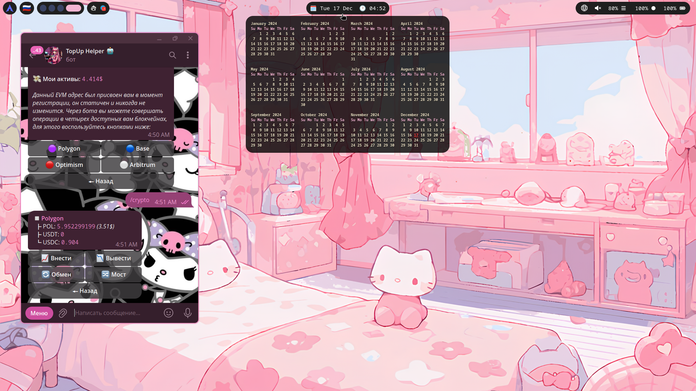

    <h1>🌸 xvnvdu's Hyprland config 🌸</h1>

## Required Packages

- **Hyprland**
- **Neofetch**
- **Spicetify**
- **Waybar**
- **Nemo**
- **Wofi** ​ ​  ​ ​  ​ ​  ​ ​ ​ ​  ​  ​ ​`not customized yet`
- **Kitty**
- **Cava**

>*And more coming soon...*

## Dependencies

- **grim**
- **slurp**
- **swaybg**
- **swappy**
- **pulseaudio**
- **wl-clip-persist**
- **ttf-nerd-fonts-symbols**

>*As far as I remember, these are most crutial programs used for my dotfiles to work properly. Probably gonna add a few more.* 
>
>*For more detailed dependencies required by every listed program you should look through programs' wiki or github pages.* 

## Quick Note

This is my simple minimalistic Hyprland config. Many features are still yet to be realized. Definitely gonna try using and customizing few more programs like Wlogout and Hyprlock, also thinking of switching Swaybg over Hyprpaper. Also wanna add more color/theme variations, using something pywall-like. 

Speaking of wireless network connection or bluetooth, there is no UI-based solution yet, so this should be done manualy via terminal:</mark>

### Bluetooth *(using `bluez-utils`)*
- `bluetoothctl` opens interactive prompt (`exit`/`quit` to close)
- `power on/off` for switching states
- `devices` to look through available devices
- `scan on/off` enter/exit discovery mode
- `pair *MAC*` to pair your device if found
- `trust *MAC*` if needed, alternatively enter a PIN if required
- `connect *MAC*` to connect chosen device

### Wireless connection *(using `iwd`)*
- `iwctl` opens interactive prompt (`exit`/`quit` to close)
- `device list` to get your wireless device name (mine is `wlan0`)
- `device wlan0 set-property Powered on/off` for switching states
- `station wlan0 scan` to scan for networks
- `station wlan0 get-networks` shows list of available networks
- `station wlan0 connect/disconnect *SSID*` for managing connection

>*When connected, it should remember your network, so next time you can simply run `(sudo) ip link set wlan0 up/down` to connect the same network.*